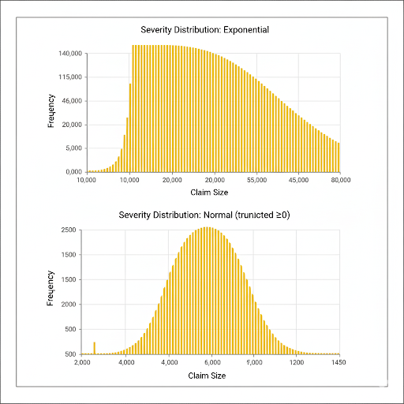

# Insurance Claims Simulation

This project models annual insurance losses using simulated claims frequency and severity distributions.  
It demonstrates actuarial concepts such as Value-at-Risk (VaR) and stop-loss reinsurance.  

## Features
- Simulated claim frequency with Poisson distribution
- Severity distributions: Exponential, Normal (truncated), Lognormal
- Calculated expected losses, variance, and 95% Value-at-Risk
- Modeled stop-loss reinsurance (80k attachment, 100k limit)
- Implemented in **Python** (NumPy, pandas, matplotlib) and **R**

## Example Plots

## Files
- `/insurance_claims_simulation.py` – Python script
- `/insurance_claims_simulation.R` – R script
- `/insurance_claims_simulation_metrics.csv` – Results

